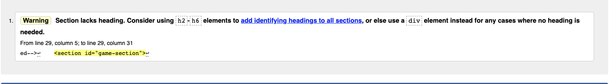
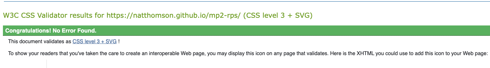

# Rock Paper Scissors
## Milestone Project 2 
### by Nat Thomson
---

Live site: 

Repository: 

## Table of Contents
1. [UX](#ux)
* Purpose of Project
* User Stories
* Design Choices
  - color scheme
  - typography
  - imagery
* Wireframes
* Additional Features

2. [Technologies Used](#technologies-used)

3. [Testing](#testing)

4. [Addressing User Stories](#addressing-user-stories)

5. [Bugs](#bugs)

6. [Deployment](#deployment)

7. [Credits](#credits) 
* Content
* Code
* Media 

___
## UX

### Purpose of Project
The purpose of this project is to create a website in which a user can play a fun game of Rock, Paper, Scissors against a computer program. The user interface should provide a simple, easy to understand UI in which to play said game. The user should be able to understand how to interact with the website with minimal intruction. The project should also ensure to keep the repository files clean and easy to manage in the event of revisiting the project to add new features in the future.
___
### User Stories
The user will:

- be able to interact with the user interface easily
- be able to play the game without the need for additional instructions
- see a live tally of wins/losses against the computer
- have the ability to refresh or exit the game at will
___
### Design Choices

### Wireframes

### Additional Features

The Konami Code: &#11014; &#11014; &#11015; &#11015; &#11013; &#11157; &#11013; &#11157; &#127313; &#127312;

If (on a desktop) you hover over the bottom-right help button the user is faced with a pop up suggesting you 'think Konami code'. This is a reference to a popular cheat code put in games in the 80s and 90s which when enterred. correctly would give you extra lives or unlimited ammo etc. When entered correctly when playing Rock Paper Scissors; all the icons change to anime style characters and points are worth double.

## Technologies Used
* Balsamiq - used for the creation of Wireframes
* HTML5, CSS3 & Javascript - languages used
* gitpod.io - IDE for coding 
* coolors.co - color scheme inspiration
* google fonts - font choice
* Dall.e 2 - AI image generation to create the icons for the Konami code easter egg
* remove.bg - used to remove the background layer on rock, paper, scissors icons
* tinypng - used for image compression 
* Chorme Devtools - used extensively for testing

## Testing

Testing has taken place at various stages of the development process starting with simple tests like applying a CSS rule to the body of the index.hmtl to see if the file paths are correct. At this stage I also added a Javascript funciton within the game.js file to see if that too linked up correctly with the index.html and style.css files. 

### Validation 

When put through the W3C html validator the following warning was returned:

The omision of headings for the welcome-section and game-page-section is done so on purpose and the inclusion of headings would infact detract from the appearance of interractivity.

When put through jshint.com there are no errrors; only some missing semi-colons (whihc JS adds iteself) and some unnassgned variables which are assigned with event handlers or results of functions. 

The W3C CSS valdator returns: 

### Desktop Lighthouse report
 

As shown above the desktop report is fairly high. The only issues I feel need addressing. The Accesibility report returns 94 due to the contrast ratio of the footer buttons. I have decide to ignore this as it is a design choice and the contrast is improved on hover. Best practise returns 92 due to a failure to load message logged to the console. This is due to an icon with a hidden image property on it with an improper file path. This although not affecting the appearance or behaviour of the site due to the style rules still being applied to the phantom icon has been resolved since. 

### Mobile Lighthouse report

The mobile report was much the same with the exception of the performance which is a dessapointing 78. This is due to the large file sie of the background image. After previous lighthouse reports I compressed the background image and changed file type to .avif whcih helped massively but on mobile it is still an issue. I toyed with the idea of displaying a black backgorund instead but I feel it would detract too much from the pverall aesthetic. 
___
## Addressing User Stories
*be able to interact with the user interface easily*

The ability to interact with the UI is clearly easy to do. The buttons are clearly labelled, the font size is of an apporpriate size across all screens and the icons are clear as to what they are. 

*be able to play the game without the need for additional instructions*

Once the Play button is pressed you are presented with only three clearly labelled options: rock, paper or scissors. As you hover over each button the cursor changes to a clearly defined clickable pointer and the button color changes to green heavily implying it is a clickable button. There is therefore very little chance the user would need further instruction. 

*see a live tally of wins/losses against the computer*

Once the user has selected the rock, paper or scissors button a message will pop up above either the You text, Computer text or both in the event of a tie. At the same time the score of the winner iterates by 1 and is displayed below the User and Computer text.

*have the ability to refresh or exit the game at will*

There is a clearly labelled 'reset' button at the bottom right hand corner of the screen. On hover the color changes to green and once pressed it closes the game-page section, reopens the welcome page and the scores are reset.
___
## Bugs 
bug 1 - when reset btn clicked, game-section does not revert to display: none
FIX - wrong keyword present in game.js line 9 - display: hidden - corrected to display: none

bug 2 - rock image will not fit inside container div
FIX - unkown but no longer an issue

BUG 3 - drop-up-content runs off the screen
FIX - Add right: 50px;

### Unresolved Bugs

___

## Deployment

In order to deploy this website you must go to the repository: https://github.com/NatThomson/mp2-rps/ > click on settings, located above green gitpod button > click on pages, located on left hand menu > under Build and deployment, source, click to deploy from branch > select main branch. Now back in the repository, when you navigate to 'environments' on the right hand side it will say github-pages. click here and you will be taken to a page with all deployments of the website. the most recent one will be labelled active. Now click VIEW DEPLOYMENT to see the love website. For further information please visit: https://docs.github.com/en/pages/quickstart

___
## Potential Future Development for the Website

In future developments I would like to add more Easter eggs like Dragon mode where all player options are dragons and they beat everything or Hard Mode where none of the buttons have any text and all the user icons appear to be hidden under a blanket. 

Asside from silly features that don't really add to the gameplay I would like to add a High scores section that would require the inputting of a username either on page load on the welcome screen or after a Game Over message that could appear after a timer had run out. 

___
## What I would have done differently 

Given the oppurtunity to start over I would do two things differently. First of all I would stick to my code plan more closely. I spent a lot of time going round in circles when the answer was often in front of me on paper the whole time. 
Secondly I would focus on the mobile design and resposiveness and scale it up to suit large screens rather than the opposite. I got far too caught up in (quite literally) the big picture. 

___
## Credits

### Content

With the exception of the code mentioned below, all code was written by myself having drawn inspiration from a variety of sources including but not limited to:
* Code Instiitute
* W3schools
* CodeCademy
* Web Dev Simplified Youtube channel 

### Code

The piece of code that I drew particularly heavily from was from the following article:
https://gomakethings.com/how-to-create-a-konami-code-easter-egg-with-vanilla-js/#:~:text=The%20Konami%20Code%20is%20Up,would%20give%20you%2030%20lives

I used this code to implement the Konami code easter egg found when (on a desktop) you type out the Konami code mentioned previously. 

### Media

The icons and backgorund image were taken from Pexels.com and the Konami code icon variants were created using the Dall.e 2 ai using various generator prompts such as “an angry, fighting anthropomorphic pair of scissors, anime”. 

### Personal 

As always credit must be given to my Wife for her continuing support, understanding and encouragement; forcing me to always aim higher. 